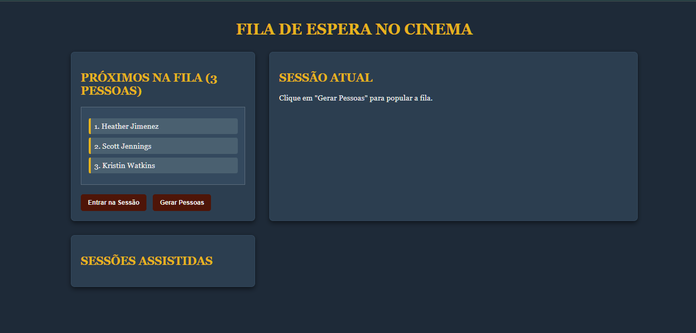

#  Sistema FIFO Cinema

Projeto desenvolvido para simular uma fila FIFO (First In, First Out) utilizando JavaScript e integração com a API OMDb para consulta de filmes.

---

##  Tecnologias Utilizadas

- HTML5
- CSS3
- JavaScript
- API OMDb
- GitHub Pages

---

##  Funcionalidades

- Simulação de fila FIFO
- Consulta de filmes através da API OMDb
- Interface simples e responsiva
- Manipulação dinâmica do DOM
- Interface responsiva

---

##  Projeto Online

https://dieguin77.github.io/Simula-o-FIFO-Fila-Cinema/

---

##  Desenvolvedor

Diego Batista Gomes Moraes

GitHub: https://github.com/Dieguin77

Portfólio: https://diegodev.dev.br

## 📷 Demonstração

